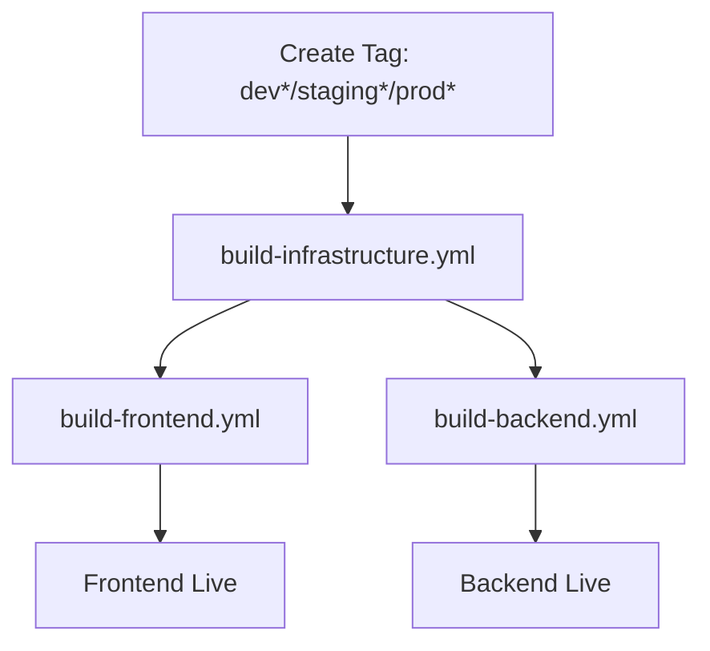

# GitHub Actions Pipeline Architecture

This repository uses a clean separation between quality gates and build/deployment processes.

## Pipeline Overview

### 🔍 Quality Gates (PR-only)
- **`pull-request-checks.yml`** - Runs on all PRs to main branch
  - Frontend: lint, type check, unit tests, build verification
  - Backend: format check, clippy, unit tests, build verification, security audit
  - Infrastructure: Bicep template validation
  - Blocks merge if any checks fail

### 🏗️ Build & Deployment (Tag-triggered)
- **`build-infrastructure.yml`** - Foundation pipeline (runs first)
  - Deploys Azure resources (Static Web Apps, PostgreSQL, Key Vault)
  - Updates GitHub secrets for dependent pipelines
  - Environment: `dev*`, `staging*`, `prod*` tags

- **`build-frontend.yml`** - Frontend deployment
  - Depends on: `build-infrastructure.yml`
  - Builds and deploys Svelte app to Azure Static Web Apps
  - Triggers on: infrastructure completion or direct tag push

- **`build-backend.yml`** - Backend deployment  
  - Depends on: `build-infrastructure.yml`
  - Builds Rust API and prepares Azure Functions deployment
  - Runs database migrations
  - Triggers on: infrastructure completion or direct tag push

## Deployment Flow

## Environment Mapping

| Tag Pattern | Environment | Azure Resources |
|-------------|-------------|-----------------|
| `dev*`      | development | rg-windspire-dev-* |
| `staging*`  | staging     | rg-windspire-staging-* |
| `prod*`     | production  | rg-windspire-prod-* |

## Benefits

✅ **Clean Separation**: Quality checks vs deployment concerns  
✅ **Controlled Deployments**: Only tagged releases deploy  
✅ **Dependency Management**: Infrastructure → Frontend/Backend  
✅ **Fast Feedback**: PRs get immediate quality feedback  
✅ **Resource Efficiency**: No unnecessary builds on PRs  

## Usage

### For Development
1. Create PR → Quality checks run automatically
2. Merge PR → No deployment (quality gates only)

### For Deployment
1. Create tag: `git tag dev-v1.2.3 && git push origin dev-v1.2.3`
2. Infrastructure deploys → Frontend & Backend deploy automatically
3. Monitor deployments in GitHub Actions tab

## Migration Notes
- Replaced: `frontend-ci-cd.yml`, `backend-ci-cd.yml`, `infrastructure.yml`
- Added: Dedicated PR quality pipeline
- Improved: Clear dependency chain and faster feedback loops