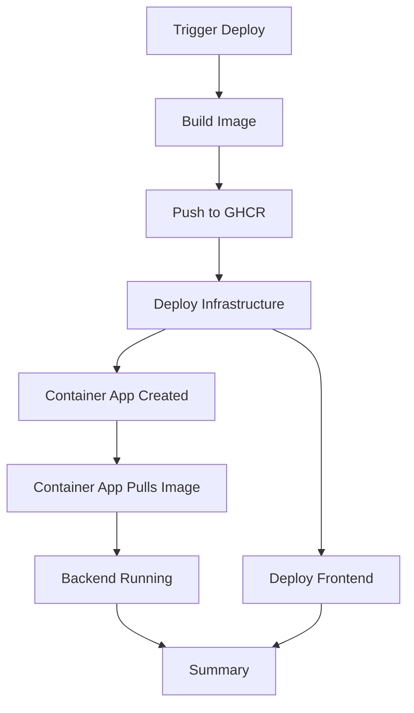

# Optimized Deployment Workflow - Removed Duplicate Image Build

## Problem

The deployment workflow was building the Docker image **twice**:

### Before (INEFFICIENT ❌):
```
Step 1: build_image
  └─ Calls build-backend-image.yml
     └─ Builds Docker image
     └─ Pushes to GHCR

Step 2: infrastructure
  └─ Deploys Container App (configured to pull from GHCR)

Step 3: backend
  └─ Calls build-backend.yml
     └─ Builds Docker image AGAIN (duplicate!)  ❌
     └─ Pushes to GHCR AGAIN (duplicate!)      ❌
     └─ Updates Container App (unnecessary)

Step 4: frontend
  └─ Deploys frontend

Step 5: summary
```

**Result**: ~10-15 minutes wasted rebuilding the same Docker image!

## Solution

Removed the redundant `backend` job from the deploy workflow.

### After (EFFICIENT ✅):
```
Step 1: build_image
  └─ Calls build-backend-image.yml
     └─ Builds Docker image ONCE
     └─ Pushes to GHCR

Step 2: infrastructure
  └─ Deploys Container App
  └─ Container App automatically pulls image from GHCR

Step 3: frontend
  └─ Deploys frontend

Step 4: summary
```

**Result**: Image built once, infrastructure deployment pulls it automatically!

## Why This Works

### Container App Automatic Deployment

When the infrastructure is deployed, the Container App is configured with:
```bicep
containers: [
  {
    name: 'windspire-backend'
    image: containerImage  // ghcr.io/hydrant/windspire-backend:latest
    // ...
  }
]
```

The Container App will:
1. ✅ Authenticate with GHCR using the provided credentials
2. ✅ Pull the latest image automatically
3. ✅ Start the container
4. ✅ Handle health checks and revisions

**No separate deployment step needed!**

## Changes Made

### File: `.github/workflows/deploy.yml`

**Removed:**
```yaml
# Step 3: Deploy backend to Container App (after infrastructure exists)
backend:
  needs: [determine_environment, infrastructure]
  uses: ./.github/workflows/build-backend.yml
  secrets:
    AZURE_CLIENT_ID: ${{ secrets.AZURE_CLIENT_ID }}
    # ... all secrets
  with:
    environment: ${{ needs.determine_environment.outputs.env_name }}
    container-app-name: ${{ needs.infrastructure.outputs.container-app-name }}
```

**Updated summary job:**
```yaml
# Before
needs: [infrastructure, backend, frontend]

# After
needs: [infrastructure, frontend]
```

## Benefits

### Time Savings ⚡
- **Before**: ~25-30 minutes total
  - Build image: 10 minutes
  - Infrastructure: 5 minutes
  - Build image again: 10 minutes ❌
  - Frontend: 2 minutes
  
- **After**: ~17-19 minutes total
  - Build image: 10 minutes
  - Infrastructure: 5 minutes
  - Frontend: 2 minutes
  
**Savings: 8-11 minutes per deployment!**

### Resource Efficiency 💰
- ✅ Reduced GitHub Actions minutes usage
- ✅ Reduced network bandwidth (no duplicate push)
- ✅ Reduced Docker layer cache usage
- ✅ Simpler workflow logic

### Reliability 🎯
- ✅ Single source of truth for the image
- ✅ No risk of inconsistency between builds
- ✅ Infrastructure always uses the correct image from Step 1

## When Would You Need the Backend Job?

The `backend` job in `build-backend.yml` is still useful for:

### Scenario 1: Update Container App Without Full Redeployment
If you want to update only the Container App (not full infrastructure):
```bash
# Manually trigger build-backend.yml workflow
# Updates Container App with new image
```

### Scenario 2: Hotfix Deployment
If you need to deploy a new image version without redeploying all infrastructure:
```bash
# Build new image
# Run backend workflow separately to update Container App
```

### Scenario 3: Development/Testing
For testing Container App updates in isolation.

## Current Workflow Files

### 1. `build-backend-image.yml`
- **Purpose**: Build and push Docker image only
- **Used by**: deploy.yml (Step 1)
- **Does**: Build → Push to GHCR

### 2. `build-backend.yml`  
- **Purpose**: Build image AND deploy to Container App
- **Used by**: ~~deploy.yml~~ (removed), can be called manually
- **Does**: Build → Push to GHCR → Update Container App

### 3. `deploy.yml`
- **Purpose**: Master orchestration
- **Uses**: build-backend-image.yml, build-infrastructure.yml, build-frontend.yml
- **Flow**: Build image → Deploy infra → Deploy frontend

## Deployment Flow Visualization



## Verification

After deployment, verify the Container App is running:

```bash
# Check Container App status
az containerapp show \
  --name windspire-api-dev \
  --resource-group rg-windspire-dev-eastus2 \
  --query "properties.provisioningState"

# Check current image
az containerapp show \
  --name windspire-api-dev \
  --resource-group rg-windspire-dev-eastus2 \
  --query "properties.template.containers[0].image"

# Should show: ghcr.io/hydrant/windspire-backend:latest
```

## Summary

✅ **Removed duplicate Docker build from deployment workflow**
✅ **Saves 8-11 minutes per deployment**
✅ **Infrastructure automatically pulls and deploys the image**
✅ **Simpler, more efficient workflow**
✅ **No functionality lost - everything still deploys correctly**

The deployment is now optimized! 🚀
